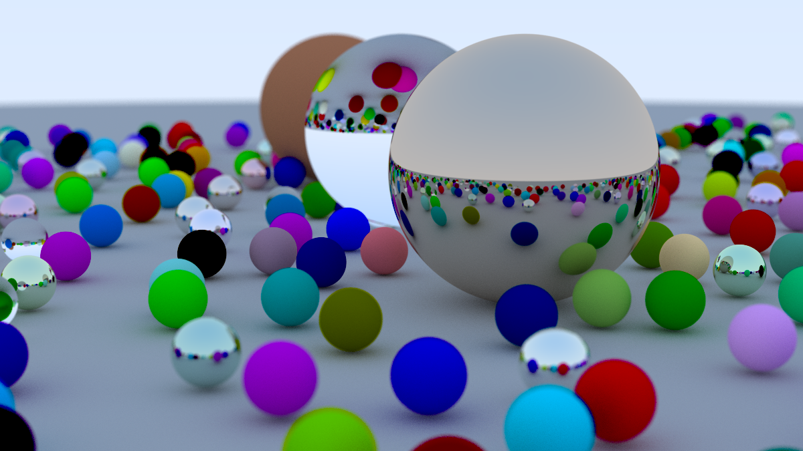
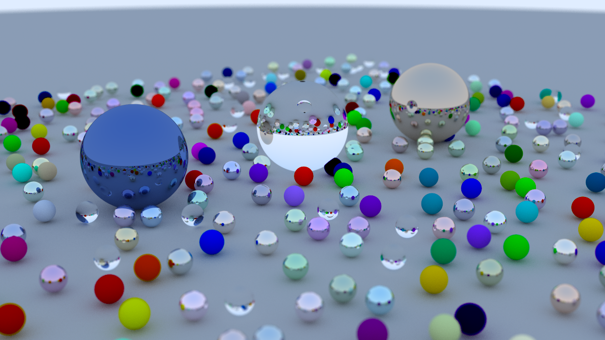

# Ray TraCing In One Weekend 

This repository contains code that was written by following "Ray Tracing in One Weekend" (it took me more than a weekend), implemented in pure C.

## Overview
This ray tracer illustrates how to render a 3D scene using:

* Spheres
* Materials (Lambertian, metal, dielectric)
* reflections and refractions
* C-style polymorphism to handle different object and material types

The output is an image written in `.ppm` format.

## Examples
Examples of rendered images:

 

## References:

[Ray Tracing in One Weekend By Peter Shirley](https://raytracing.github.io/books/RayTracingInOneWeekend.html)